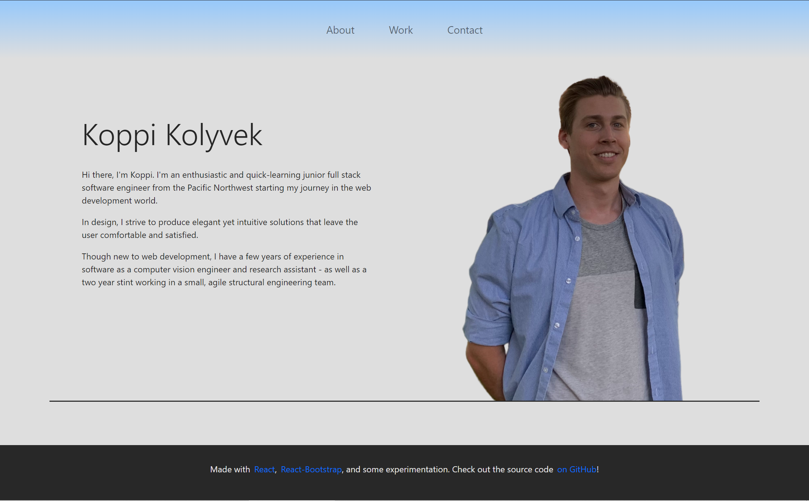

<h1 align="center"><strong>Koppi's Online Portfolio</strong></h1>

<h2 align="center">
  <a href="https://kk-react-portfolio.herokuapp.com/">Deployed Site</a>
</h2>

This repository contains the source code for Koppi Kolyvek's online portfolio. The site is a react app, built with the help of [React-Bootstrap](https://react-bootstrap.github.io/) to assist with responsiveness and styling.

The 'work' section features cards with project information that will lead to the deployed project when clicked.

 

> 
